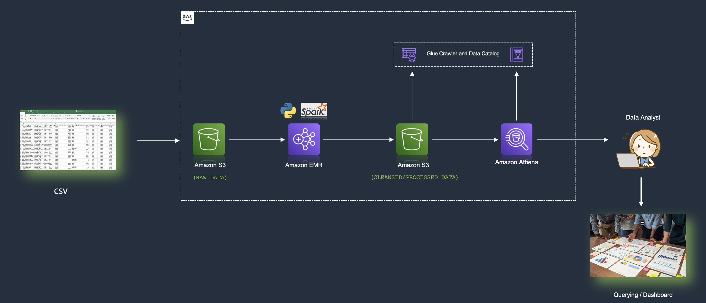

# Scalable Data Engineering & Machine Learning on AWS

This project demonstrates building end-to-end **data engineering** and **machine learning (ML)** workflows using **Apache Spark**, **Amazon EMR**, **S3**, **Glue**, and **SageMaker Studio**. The goal is to extract, transform, and load (ETL) large datasets, prepare them for ML, and deploy predictive models efficiently.

---

## Overview

Data preparation is a critical step for analytics and ML. This project covers:

- Building ETL pipelines with **Apache Spark** on **Amazon EMR**
- Storing raw and processed data in **Amazon S3**
- Using **AWS Glue** for schema discovery and cataloging
- Performing interactive data preparation using **Amazon SageMaker Studio**
- Training and deploying ML models to predict real-world outcomes (e.g., air quality prediction based on weather data)

---

## Problem Statements

1. **Batch ETL Use Case:**  
   Vendor provides incremental sales data monthly in S3 as CSV files. Data must be transformed and stored for analysts to query via Amazon Athena.

2. **ML Use Case:**  
   Predict **NO₂ concentration** in cities using weather parameters (mean temperature, max/min temperatures, etc.). This requires cleaning, transforming, and preparing data for model training and deployment.

---

## Architecture

The architecture includes:

- **Amazon S3:** Store raw (`raw_data`) and cleansed (`cleaned_data`) datasets  
- **Amazon EMR with Spark:** Process and transform large datasets  
- **AWS Glue:** Catalog datasets for querying  
- **Amazon Athena:** Query and analyze processed datasets  
- **Amazon SageMaker Studio:** Interactive environment for ML model training, evaluation, and deployment  


---

## Implementation Steps

### 1. Create EMR Cluster
- Create an **EC2 Key Pair** to access EMR master node
- Launch an **EMR cluster** with Spark installed
- Wait until the cluster status is `Waiting` (ready for jobs)

### 2. Set Up S3 Bucket
- Create an S3 bucket (e.g., `etl-batch-emr-demo`)  
- Create folders: `raw_data` and `cleaned_data`  
- Upload dataset CSV to `raw_data`

### 3. Submit PySpark ETL Job
- SSH into EMR master node  
- Upload and configure `etl-job.py` with S3 paths  
- Run the PySpark job:  
```bash
sudo spark-submit etl-job.py
```
Transformed data is saved to cleaned_data in Parquet format

### 4. Catalog Data Using AWS Glue

- Create a Glue Crawler pointing to cleaned_data folder
- Run crawler to generate a Glue Data Catalog table
- Query the table using Amazon Athena

Example Athena queries:
```sql
SELECT * FROM "my_demo_db"."cleaned_data" LIMIT 10;
SELECT region, segment, SUM(forecasted_monthly_revenue) AS forecast_monthly_revenue
FROM "my_demo_db"."cleaned_data"
GROUP BY region, segment;
```
### 5. ML Workflow with SageMaker Studio

- Launch SageMaker Studio Notebook
- Connect to EMR clusters directly from Studio
- Clean and prepare data with Spark/Pandas
- Train and deploy ML model (e.g., NO₂ prediction)
- Store training data in S3 and host models in SageMaker

## Clean Up Resources

- To avoid extra costs, delete:
- EMR Cluster
- S3 Bucket
```bash
aws s3 rb s3://<YOUR_BUCKET_LOCATION> --force
```
- Glue Database

## Key Tools & Services

- Apache Spark: Distributed data processing
- Amazon EMR: Scalable cluster computing
- Amazon S3: Object storage for raw and processed data
- AWS Glue: Data cataloging and ETL
- Amazon Athena: SQL query engine for S3 data
- Amazon SageMaker Studio: ML IDE for training and deployment
- Python & PySpark: Programming for data processing and ML

## Conclusion

This project demonstrates how to build scalable ETL pipelines and machine learning workflows on AWS:

- Extract, transform, and store large datasets efficiently
- Catalog data for analytics and querying
- Train, evaluate, and deploy ML models
- Perform predictive analytics at scale
