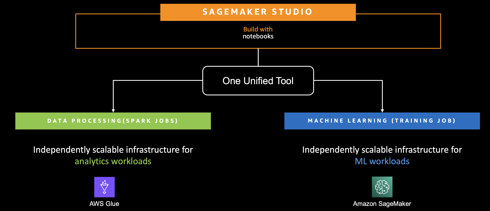
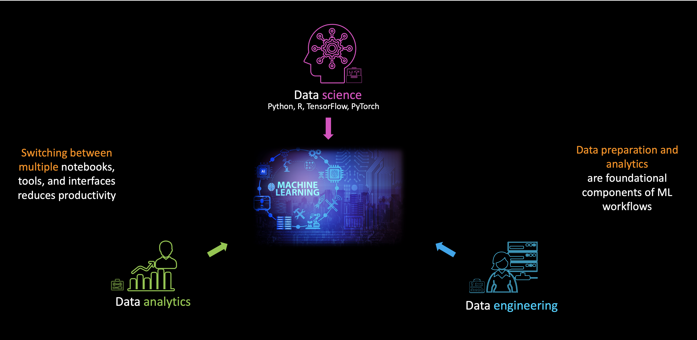
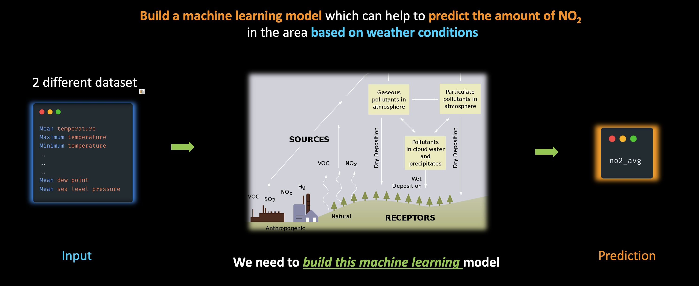

# Serverless Data Preparation with Glue Interactive Sessions (from `SageMaker Studio`)  

This demo showcases how to leverage **Apache Spark on AWS Glue** for large-scale data preparation, followed by building an **urban air quality prediction model** using Amazon SageMaker.  

  

---

## Introduction  

Traditionally, many organizations treat **data engineering, data analytics, and data science** as isolated functions. However, in practice, these disciplines are deeply interconnected. Effective machine learning workflows rely heavily on **data preparation and analytics** as foundational steps.  

Even if a central data engineering team prepares curated datasets, the exact data required for a specific ML model might not always be available. This demo demonstrates how **serverless data preparation with Glue** can bridge that gap and streamline the ML workflow inside **SageMaker Studio**.  

  

---

## Problem Statement  

Urban air pollution is a pressing issue that affects human health, ecosystems, and infrastructure. One critical pollutant is **Nitrogen Dioxide (NO₂)**, commonly linked to vehicular traffic and industrial emissions.  

Our goal is to develop a **machine learning model** that predicts **NO₂ concentration levels** in a city at a specific time, based on **weather conditions**.  

The input features will include:  
- Mean temperature  
- Maximum temperature  
- Minimum temperature  
- Other weather-related attributes  

The output will be the **predicted NO₂ level**, providing actionable insights for air quality monitoring and management.  

  

---

## Datasets  

For this project, we use two open datasets available on AWS:  

- **[OpenAQ – Air Quality Data](https://registry.opendata.aws/openaq/)**  
  - Global aggregated physical air quality data from public, research, and government sources  
  - ~42 GB of data  

- **[NOAA Global Surface Summary of Day (GSOD)](https://registry.opendata.aws/noaa-gsod/)**  
  - Daily global meteorological summaries derived from multiple observational datasets  
  - Includes 18 key weather attributes  

---

## Workflow & Code  

The demo is structured into two main parts, with notebooks provided for reproducibility:  

1. **Data Preparation with AWS Glue + Spark**  
   - [1.DataProcessingGlue.ipynb](code/1.DataProcessingGlue.ipynb)  

2. **Model Training & Deployment with Amazon SageMaker**  
   - [2.ModelBuildingDeployment.ipynb](code/2.ModelBuildingDeployment.ipynb)  

---
