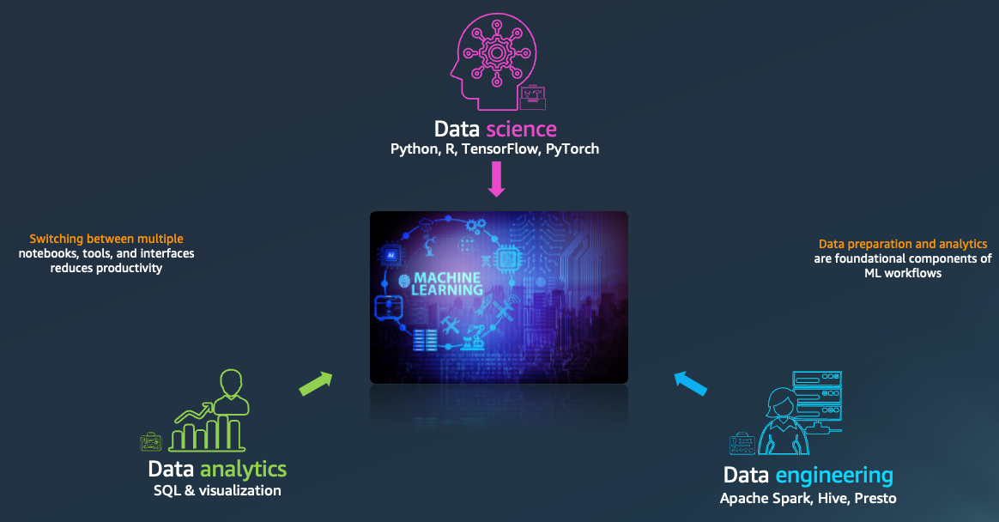
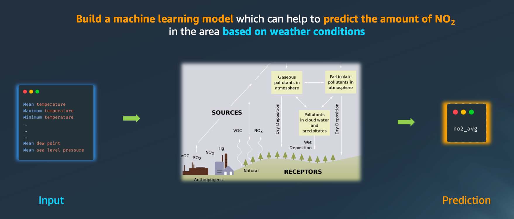
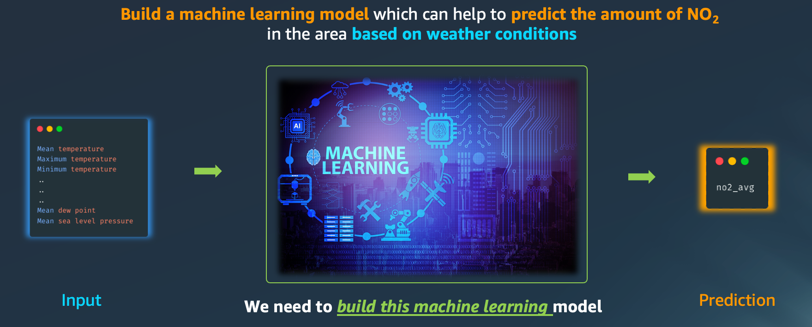
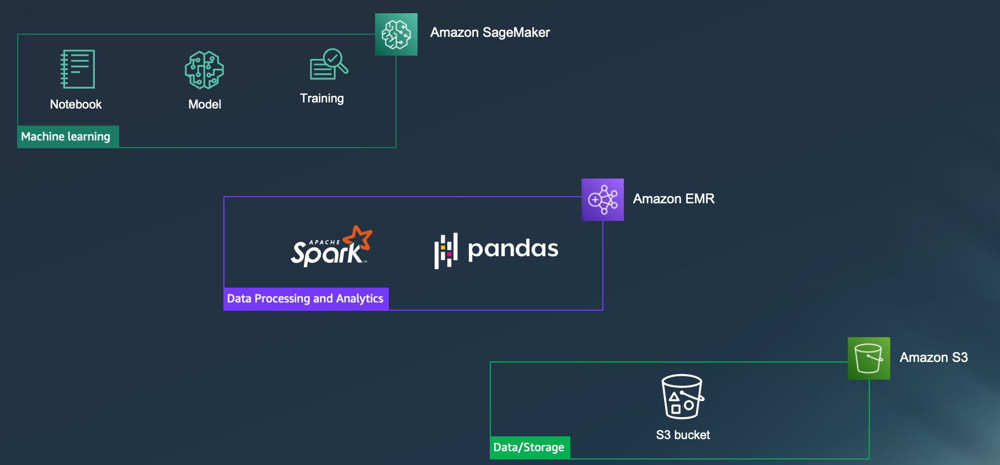
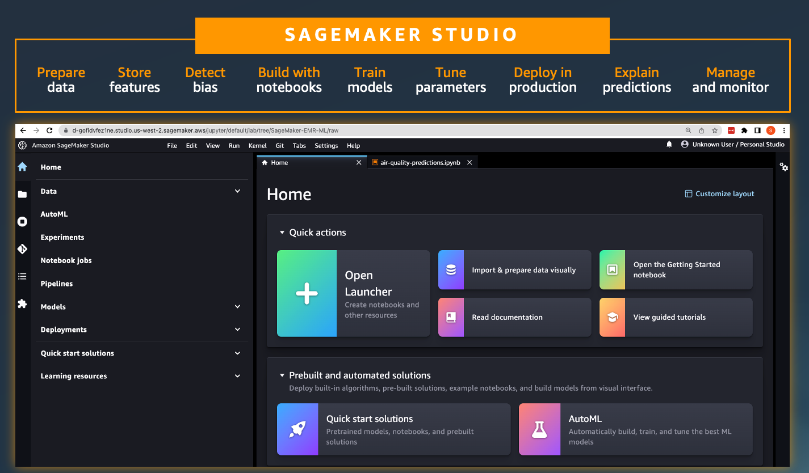
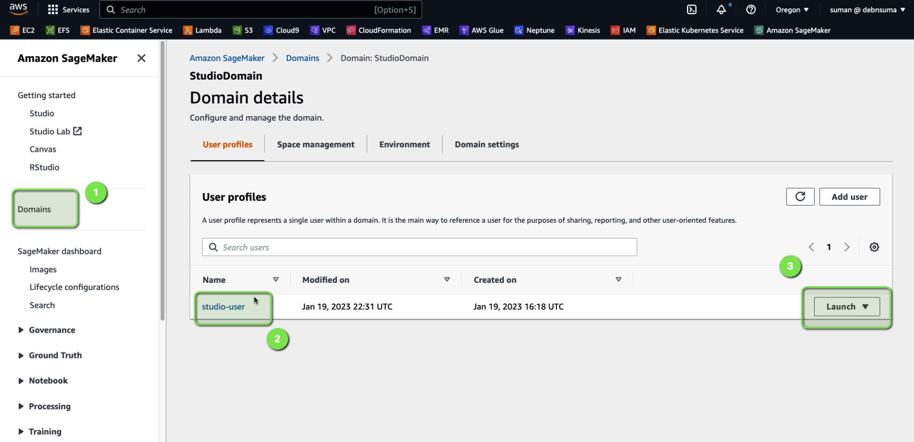

# Scalable Data Preparation & Machine Learning with Apache Spark on AWS  

Preparing, transforming, and analyzing large datasets is a critical first step in any data science or machine learning (ML) workflow. This session demonstrates how to build end-to-end **data preparation and ML pipelines** using Apache Spark, Amazon EMR, and Amazon SageMaker Studio.  

You’ll also learn how to access data governed by **AWS Lake Formation**, interactively query and explore data, visualize datasets, and run/debug Spark jobs for large-scale ML preparation.  

For a code walk-through, you can refer to the session **[Scalable Data Preparation & ML using Apache Spark on AWS](https://aws.amazon.com/events/aws-innovate/apj/aiml-data/)** at **AWS Innovate 2023 (Data and Machine Learning)**.  

---

## Introduction  

Traditionally, data engineering, data science, and analytics have been treated as separate silos. However, modern ML workflows increasingly rely on **data preparation and analytics as foundational components**.  

While data engineering teams may clean and prepare data for analytics, the exact subset of data needed for training a specific ML model may not be readily available. This gap highlights the importance of integrated data preparation workflows for ML.  

  

---

## Problem Statement  

Consider the challenge of **air pollution in cities**, which can have harmful effects on people, animals, plants, and property.  

We aim to build a machine learning model that predicts **NO2 (nitrogen dioxide) levels** based on weather conditions.  

The model will take inputs such as:  
- Mean temperature  
- Maximum temperature  
- Minimum temperature  
- Other relevant weather parameters  

The output will be the predicted **NO2 concentration levels** for a given city at a specific time.  

  
  

---

## Solution Overview  

The solution involves two major stages:  

1. **Data Preparation and Cleaning**  
   - Use **Apache Spark** on **Amazon EMR** to clean and transform the dataset for ML training.  

2. **Model Training and Deployment**  
   - Use **Amazon SageMaker** to train and host the ML model.  
   - Perform analysis with **Pandas** for smaller data transformations.  
   - Store training datasets in **Amazon S3**.  

  

Multiple services and tools are integrated seamlessly, so you can focus on building the ML pipeline without managing infrastructure manually.  

---

## Amazon SageMaker Studio  

**Amazon SageMaker Studio** is a fully integrated ML development environment (IDE). Key benefits:  
- Browse and connect to **Amazon EMR clusters** directly from the Studio notebook.  
- Provision and terminate EMR clusters from within Studio.  
- Run Spark jobs interactively for scalable data preparation.  

  

---

## Implementation Steps  

### 1. Create the Environment  

AWS provides a **CloudFormation template** to set up a demonstration SageMaker domain with:  
- A private VPC  
- SageMaker domain attached to the VPC  
- Pre-configured SageMaker user with access to the AWS Service Catalog product  

Deploy the environment using this template:  
[CloudFormation Template](/code/CFN-SagemakerEMRNoAuthProductWithStudio-v3.yaml)  

---

### 2. Launch SageMaker Studio Notebook  

After deploying the CloudFormation stack:  
1. Open the **Amazon SageMaker** console  
2. Navigate to **Domains** on the left menu  
3. Select your **StudioDomain**  
4. Click **Launch** for the `studio-user`  

  

---

### 3. Air Quality Predictions  

1. Download the Jupyter Notebook for this demo: [demo-sm-emr.ipynb](/code/demo-sm-emr.ipynb)  
2. Import it into your SageMaker Studio Notebook  
3. Follow the instructions to preprocess the data with Spark, train the ML model, and deploy it for predictions  

---

## Conclusion  

This session demonstrates how to:  
- Prepare and clean large datasets using **Apache Spark on EMR**  
- Train and deploy ML models using **Amazon SageMaker Studio**  
- Integrate scalable data pipelines for ML efficiently using AWS services  

By the end, you will have a complete workflow from raw data ingestion to model deployment for predictive analytics.  
