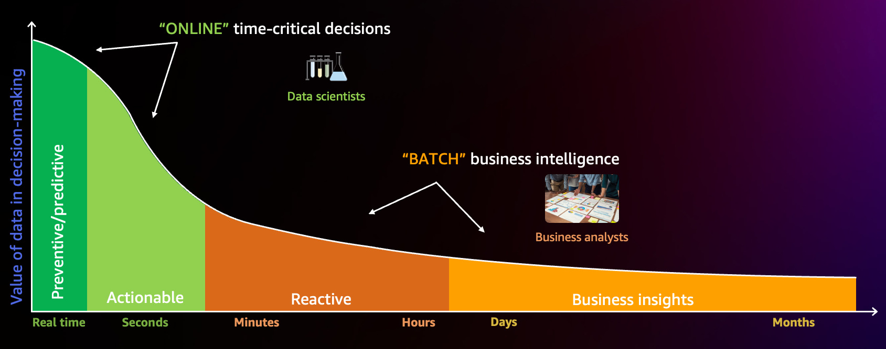
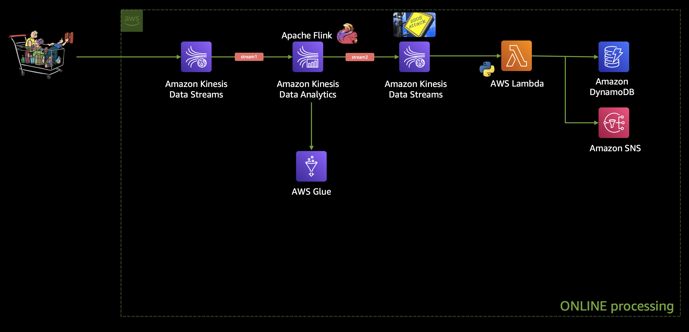
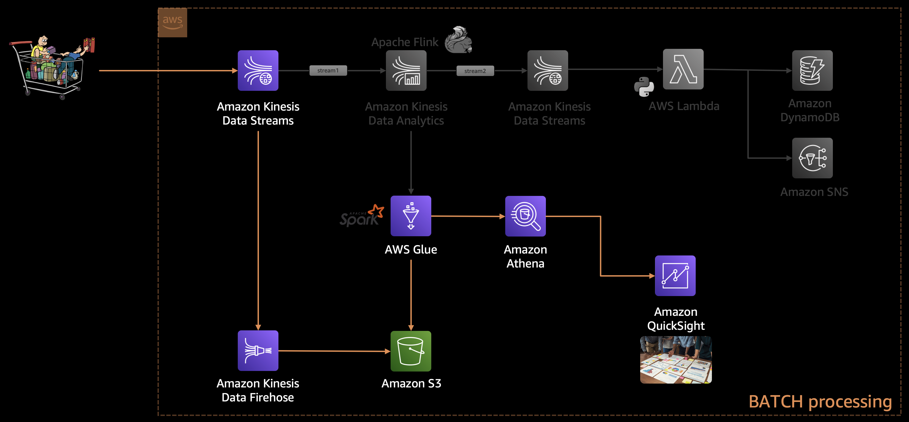

# Building a Managed Analytics Platform for E-Commerce on AWS  

With the rapid rise of online shopping, it has become essential for businesses to establish an **analytics platform** that provides insights into customer behavior, sales patterns, and operational trends. Beyond standard reporting, such platforms can surface hidden insights that enable data-driven, revenue-boosting business decisions.  

In this project, we demonstrate how to design a **complete analytics solution** on AWS, supporting both **batch** and **real-time** data processing. The real-time pipeline is also equipped to detect **Distributed Denial of Service (DDoS)** and **bot attacks**, a common requirement in e-commerce systems.  

---

## Introduction  

**E-commerce analytics** refers to the process of capturing, processing, and analyzing data from all customer interactions across the online journey—from product discovery and acquisition, through conversion, to post-purchase engagement and retention.  

In this two-part series, we create an **end-to-end analytics platform** using an [e-commerce dataset from Kaggle](https://www.kaggle.com/datasets/mkechinov/ecommerce-behavior-data-from-multi-category-store). The dataset simulates logs of user behavior such as:  
- Product views  
- Cart additions  
- Purchases  
- Session history  

We will implement two complementary pipelines:  
- **Batch Processing** – for aggregated, historical analysis  
- **Real-time Processing** – for streaming analytics, including anomaly detection  

For a video walk-through, refer to [this AWS session](https://www.youtube.com/watch?v=DvCjIVcs9KA&t=16s&ab_channel=AWSEvents).  

  

---

## Batch Processing  

The **batch pipeline** leverages Amazon Kinesis, AWS Glue, Amazon S3, and Amazon QuickSight to answer key questions such as:  
- How many unique visitors are there per day?  
- Which users add items to carts but fail to complete purchases?  
- What are the most popular product categories per day or week?  
- Which brands need targeted marketing efforts?  

---

## Real-Time Processing  

The **real-time pipeline** uses AWS services including Lambda, DynamoDB, CloudWatch, and SNS to:  
- Detect unusual activity (e.g., DDoS and bot attacks)  
- Trigger alerts for rapid response  
- Store fraudulent activity in a persistent datastore  

This README focuses on the **real-time streaming pipeline**. Batch processing is covered in the next part of the series.  

---

## Dataset  

We use the **E-Commerce Behavior Dataset** from Kaggle:  

- **Source**: [Multi-category store dataset](https://www.kaggle.com/datasets/mkechinov/ecommerce-behavior-data-from-multi-category-store)  
- **Coverage**: 7 months of data (Oct 2019 – Apr 2020)  
- **Format**: Each record represents a user-event interaction (product views, cart additions, purchases, etc.)  
- **Size**: Millions of records simulating real-world e-commerce workloads  

---

## Architecture  

### Real-Time Processing  

1. **Input**: User activity logs ingested into an **Amazon Kinesis Data Stream** (`stream1`)  
2. **Stream Analytics**: An **Apache Flink application** running on **Kinesis Data Analytics** inspects data for abnormal activity (e.g., excessive events from a single user)  
3. **Filtered Output**: Suspicious activity is forwarded to a second Kinesis Data Stream (`stream2`)  
4. **Metadata Management**: AWS Glue Data Catalog stores schema definitions  
5. **Event Response**: `stream2` triggers an **AWS Lambda function** that:  
   - Stores incident data in DynamoDB  
   - Sends alerts via Amazon SNS  
   - Updates CloudWatch metrics for monitoring  

  

### Batch Processing  

To ensure reliability, **raw data** is also persisted to **Amazon S3** via **Kinesis Firehose**. This enables:  
- **Reprocessing** in case of application errors  
- Historical analysis with **AWS Glue + Athena**  
- Business intelligence dashboards using **Amazon QuickSight**  

  

---

## Implementation Steps  

The README includes detailed, step-by-step guidance covering:  
1. **Dataset preparation** – downloading, unzipping, and sampling records  
2. **S3 setup** – creating a storage bucket for raw and sample data  
3. **Kinesis streams** – configuring `stream1` and `stream2`  
4. **Traffic simulation** – using a Python script to mimic real-world e-commerce activity  
5. **Kinesis Data Analytics** – writing SQL with Flink in Apache Zeppelin notebooks  
6. **Lambda + DynamoDB + SNS** – building serverless components for real-time detection and alerts  
7. **Monitoring** – observing activity in the Apache Flink dashboard and DynamoDB  

The project guide also includes example commands, SQL snippets, and screenshots for each step.  

---

## Summary  

In this part of the project, we successfully built a **real-time analytics pipeline** for an e-commerce platform using AWS.  

- **Traffic Simulation**: Python script to mimic user activity  
- **Streaming Data Ingestion**: Amazon Kinesis  
- **Anomaly Detection**: Apache Flink (SQL) running on Kinesis Data Analytics  
- **Event Handling**: AWS Lambda, DynamoDB, CloudWatch, and SNS  

In the **next part**, we extend the architecture to **batch processing**, enabling advanced insights with Athena and QuickSight, such as:  
- Identifying frequent visitors  
- Ranking top-selling and underperforming products  
- Highlighting leading brands across categories  

This two-part solution provides a **scalable, managed analytics platform** that balances **real-time responsiveness** with **deep historical analysis**.  
