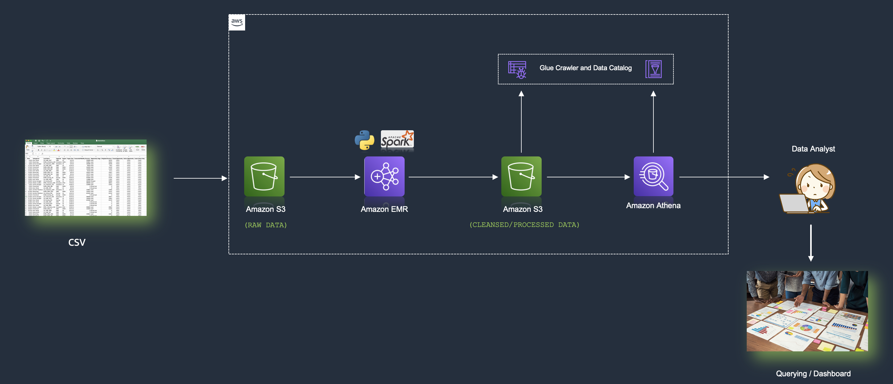

# Building an ETL Pipeline with Amazon EMR and Apache Spark  

**ETL (Extract, Transform, Load)** — also referred to as **Ingest, Transform, and Export** — is a core component of modern data engineering pipelines. When designed effectively, ETL pipelines provide high business value for both batch and real-time analytics. However, building such pipelines can be complex due to the wide variety of tools and frameworks in the big data ecosystem.  

This tutorial shows how to simplify batch ETL by using **Amazon EMR (Elastic MapReduce)** with **Apache Spark**. By the end, you’ll have a working pipeline that ingests raw data, applies transformations, and outputs cleansed data ready for analysis.  

We’ll use **PySpark**, which allows writing Spark jobs in Python.  

---

## Learning Objectives  

By following this guide, you will learn how to:  
- Create and configure an **Amazon EMR cluster**  
- Submit and run a **PySpark ETL job**  
- Integrate **Amazon EMR with Amazon S3** for data storage  
- Query processed data using **Amazon Athena**  

---

## Prerequisites  

Before starting, ensure you have:  
- An active **AWS account** ([setup guide](https://aws.amazon.com/getting-started/guides/setup-environment/))  
- An **IAM user** with permissions to create and manage AWS resources  
- Basic knowledge of **Python**  

---

## Use Case  

Imagine a vendor provides incremental **monthly sales data** as CSV files, delivered to an Amazon S3 bucket. These files must be processed, cleaned, and stored in a structured format so analysts can query them easily.  

---

## Architecture  

We will build a pipeline that:  
1. Pulls raw sales CSV files from S3  
2. Transforms the data using **Spark on EMR**  
3. Writes cleansed data back into S3 (in **Parquet format**)  
4. Makes the data queryable through **Glue Data Catalog** and **Amazon Athena**  

  

---

## Implementation Steps  

### Step 1: Create an Amazon EMR Cluster  
- Generate a **Key Pair** in EC2 to allow SSH access.  
- Launch an EMR cluster with **Spark** pre-installed.  
- Wait until the cluster reaches the `Waiting` state.  

### Step 2: Set Up Amazon S3  
- Create a new **S3 bucket** (e.g., `etl-batch-emr-demo`).  
- Add two folders:  
  - `raw_data` → for input CSV files  
  - `cleaned_data` → for processed output  
- Upload the [SalesData.csv](https://github.com/aws-samples/data-engineering-on-aws/blob/main/dataset/SalesData.csv) file to the `raw_data` folder.  

### Step 3: Submit a PySpark Job  
- SSH into the EMR master node.  
- Copy the [ETL job script](https://github.com/aws-samples/data-engineering-on-aws/blob/main/create-an-etl-pipeline-apache-spark/emr-etl-job.py).  
- Update S3 input/output paths inside the script.  
- Run the job with:  
  ```bash
  sudo spark-submit etl-job.py
  ```
Once complete, check cleaned_data in S3 for transformed files.

### Step 4: Catalog Data with AWS Glue
Create a Glue Crawler pointing to the cleaned_data location in S3.
Assign an IAM role with access to S3 and Glue.
Run the crawler to create a table inside a Glue database (e.g., my_demo_db).

### Step 5: Query Data with Amazon Athena

Open the Athena query editor.
Select the Glue database and run:
```sql 
SELECT * FROM "my_demo_db"."cleaned_data" LIMIT 10;
```
Run custom SQL queries for analysis (e.g., forecast monthly revenue by region and segment).

## Cleanup

To avoid ongoing costs, delete the following resources after completing the tutorial:

### EMR Cluster

### S3 bucket (with raw and processed data)
### Glue Database

## Conclusion

In this tutorial, you built a batch ETL pipeline using Amazon EMR and Apache Spark. You learned how to:
- Extract sales data from Amazon S3
- Transform it with PySpark into Parquet format
- Store cleansed data back into S3
- Query results with Athena via Glue Data Catalog

This pipeline demonstrates a reusable approach for many real-world batch use cases such as e-commerce sales reporting and business intelligence dashboards.